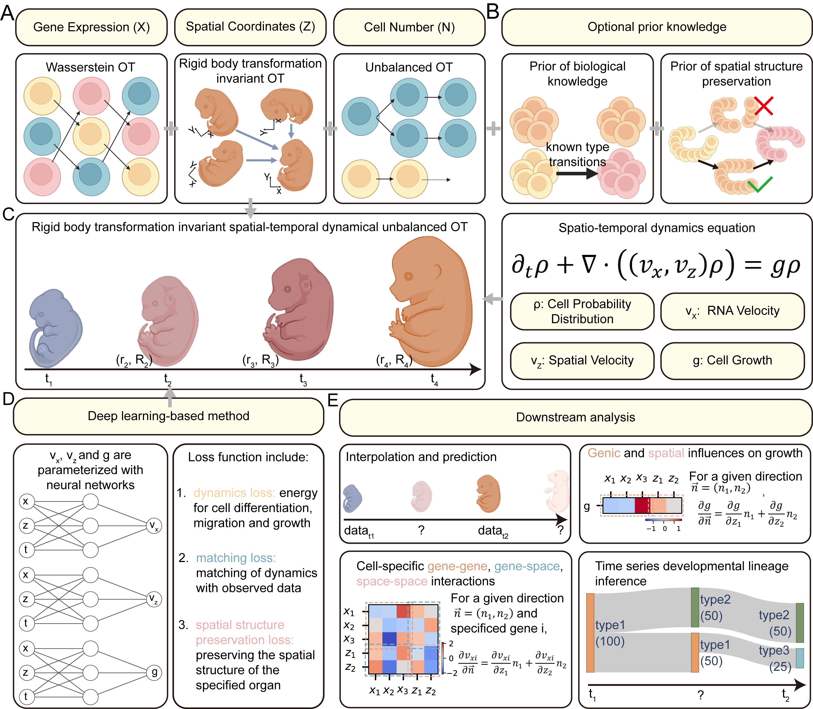

<center class=img>

</center>

# stVCR: Reconstructing spatiotemporal dynamics of cell development using optimal transport

# Abstract
Time-series spatial transcriptome data with single-cell resolution provide an opportunity to study cell differentiation, growth and migration in physical space over time. Due to the destructive nature of sequencing, simultaneous reconstruction of cell differentiation, growth and migration trajectories remains challenging, especially migration in physical space, as the coordinates obtained at different temporal snapshots are not in the same coordinate system. To realize this potential, we developed stVCR, which is an optimal transport algorithm with dynamical form, unbalanced setting, invariance to rigid body transformations and optionally modeling known biological prior and spatial structure preservation prior. stVCR extends the previous algorithm, which only reconstructs differentiation trajectories and population growth, to end-to-end simultaneously reconstruct cell differentiation, growth, migration in physical space and align spatial coordinates of multiple spatial transcriptome  snapshots. In addition, stVCR allows the study of the interaction between gene expression and spatial migration and the effect of gene expression and spatial migration on growth.
<center class=img>

</center>

# Citation
stVCR: Reconstructing spatiotemporal dynamics of cell development using optimal transport

Qiangwei Peng, Peijie Zhou*, Tiejun Li*

[bioRxiv preprint](https://www.biorxiv.org/content/10.1101/2024.06.02.596937v1)

If you use the stVCR, please cite
> ```
> @article{peng2024stvcr,
>   title={stVCR: Reconstructing spatio-temporal dynamics of cell development using optimal transport},
>   author={APeng, Qiangwei and Zhou, Peijie and Li, Tiejun},
>   journal={bioRxiv},
>   pages={2024--06},
>   year={2024},
>   publisher={Cold Spring Harbor Laboratory}
> }
> ```


# Highlights of stVCR:
---