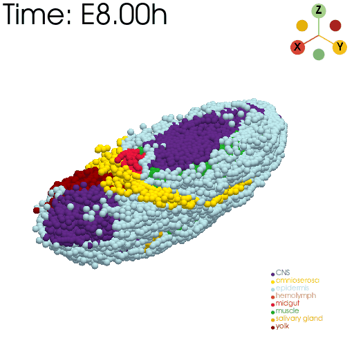

<div align=center>

</div>

# stVCR: Spatiotemporal dynamics of single cells

## Highlights of stVCR:
### Generate vivid “videos” by users directly
* **Axolotl brain regeneration**
<div align=center>

</div>

* **3D Drosophila embryo development**
<div align=center>

</div>

## Abstract
Time-series spatial transcriptome data with single-cell resolution provide an opportunity to study cell differentiation, proliferation and migration in physical space over time. Due to the destructive nature of sequencing,  reconstruction of spatiotemporal dynamics from data remains challenging. Especially, the inference of migration in physical space remains a difficult task, as samples obtained at different temporal snapshots might not be in the same coordinate system due to the difference of biological replicates. Here we developed stVCR, a generative deep learning model, which integrates the dynamical optimal transport (OT) with the unbalanced setting, the density matching invariant to rigid body transformations as well as priors to model known biology and preserve spatial structure. stVCR achieves the end-to-end simultaneous reconstruction of continuous cell differentiation, proliferation, physical space migration, and spatial coordinates alignment from spatial transcriptome snapshots. In addition, stVCR allows the interpretable study of complex interactions between cell phenotype transition, spatial migration and proliferation. Through benchmarking on both simulation data and real datasets, we validated the effectiveness and robustness of stVCR and demonstrated its advantages over static OT or linear interpolation methods.  We applied stVCR to dissect spatiotemporal dynamics underlying axolotl brain regeneration and 3D Drosophila embryo development.
<div align=center>

</div>

## Citation
stVCR: Reconstructing spatiotemporal dynamics of cell development using optimal transport

Qiangwei Peng, Peijie Zhou*, Tiejun Li*

[bioRxiv preprint](https://www.biorxiv.org/content/10.1101/2024.06.02.596937v1)

If you use the stVCR, please cite
> ```
> @article{peng2024stvcr,
>   title={stVCR: Reconstructing spatio-temporal dynamics of cell development using optimal transport},
>   author={APeng, Qiangwei and Zhou, Peijie and Li, Tiejun},
>   journal={bioRxiv},
>   pages={2024--06},
>   year={2024},
>   publisher={Cold Spring Harbor Laboratory}
> }
> ```
