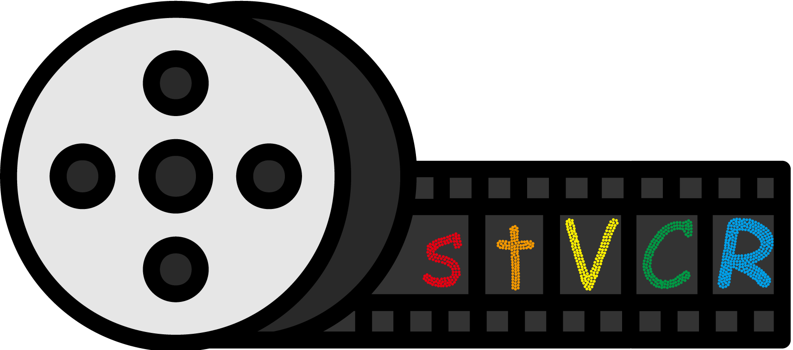
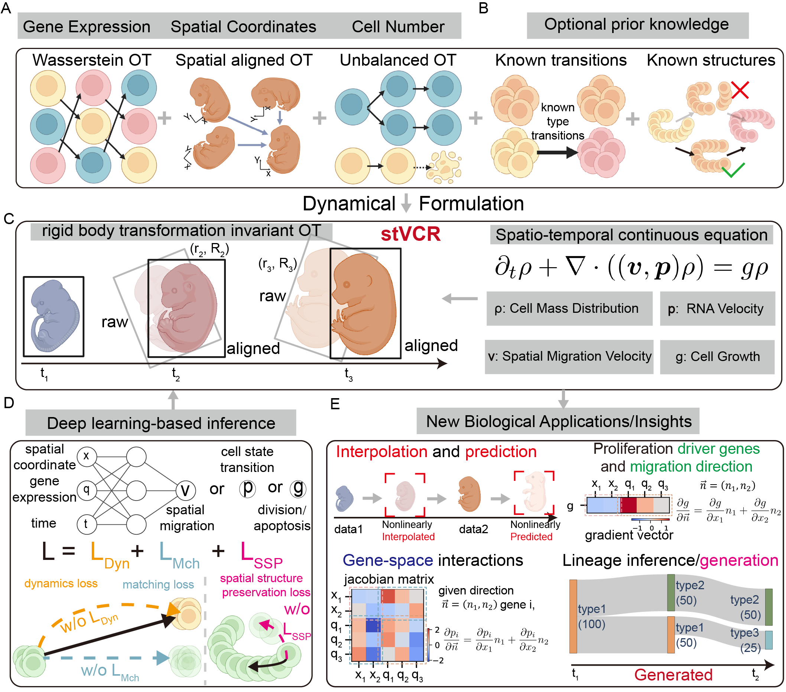

<div align=center>

</div>

##
[](https://doi.org/10.1038/s41592-026-03010-3)
[](https://github.com/QiangweiPeng/stVCR/stargazers)
[](https://github.com/QiangweiPeng/stVCR/commits/main)
<!--
[](https://github.com/QiangweiPeng/stVCR/network)
[](https://github.com/QiangweiPeng/stVCR/issues)
[](https://github.com/QiangweiPeng/stVCR/blob/main/LICENSE)
-->

## **stVCR**: Spatiotemporal dynamics of single cells
Just like how our brains can stitch together a burst of some photos into a smooth video, stVCR reconstructs the hidden movie behind spatial transcriptomics snapshots. Given a few well-timed frames of cellular life, it reveals how each cell migrates, divides, dies, or rewires its gene expression—frame by frame. No microscope can film this directly, but with stVCR, you get a front-row seat to the drama of development, one invisible scene at a time.
<div align=center>

</div>

## 🌟 Highlights of stVCR:
* Generate vivid “videos” by users directly
  * **Axolotl brain regeneration**
    <div align=center>
    
    </div>

* Interpolation and prediction of unobserved data

* Revealing the interactions among gene expression, migration and proliferation in dynamics

* Generate the developmental lineage even at unobserved time points

## 🛠 Installation
### 📦 PyPI (Coming Soon!)
We will soon release a stable version of **stVCR** on [PyPI](https://pypi.org/). Stay tuned!

### 🔨 Manual Installation (Current)
Currently, you can install the development version directly from GitHub.


## 📖 Citation
If you use **stVCR** in your research, please cite our official paper published in *Nature Methods*:

> **Peng, Q., Zhou, P. & Li, T. stVCR: Spatiotemporal dynamics of single cells. *Nat Methods* (2026). https://doi.org/10.1038/s41592-026-03010-3**

> ```
> @article{peng2026stvcr,
>   title={stVCR: Spatiotemporal dynamics of single cells},
>   author={Peng, Qiangwei and Zhou, Peijie and Li, Tiejun},
>   journal={Nature Methods},
>   year={2026},
>   publisher={Nature Publishing Group US New York}
> }
> ```

## 📢 News

* **2026-03-12**: 🎉 stVCR is officially published online in ***Nature Methods***! Read the full paper [here](https://doi.org/10.1038/s41592-026-03010-3).
* **2025-10-09**: 🎉 stVCR has been **accepted in principle** by ***Nature Methods***.
* **2024-06-02**: 📝 The preprint of stVCR was released on [bioRxiv](https://www.biorxiv.org/content/10.1101/2024.06.02.596937v1).

## 🏗 Contributing

We welcome contributions from the community! Whether you're fixing a bug, adding a new feature, or improving documentation, your help is appreciated. Reach out to the maintainer: **Qiangwei Peng** (彭强威).

✉️ [qiangwei_peng@stu.pku.edu.cn](mailto:qiangwei_peng@stu.pku.edu.cn) or [qiangweipeng123@gmail.com](mailto:qiangweipeng123@gmail.com)