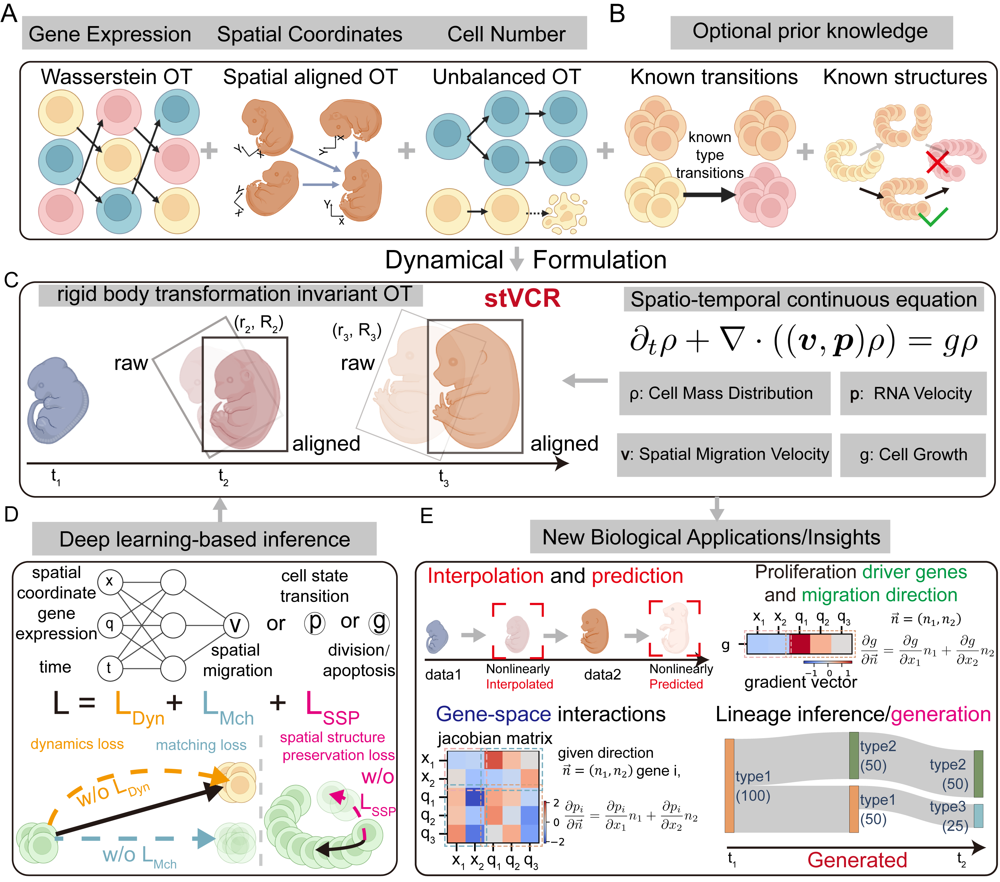

<div align=center>

</div>

##

[](https://github.com/QiangweiPeng/stVCR/stargazers)
[](https://github.com/QiangweiPeng/stVCR/commits/main)
<!--
[](https://github.com/QiangweiPeng/stVCR/network)
[](https://github.com/QiangweiPeng/stVCR/issues)
[](https://github.com/QiangweiPeng/stVCR/blob/main/LICENSE)
-->

## **stVCR**: Spatiotemporal dynamics of single cells
Just like how our brains can stitch together a burst of some photos into a smooth video, stVCR reconstructs the hidden movie behind spatial transcriptomics snapshots. Given a few well-timed frames of cellular life, it reveals how each cell migrates, divides, dies, or rewires its gene expression—frame by frame. No microscope can film this directly, but with stVCR, you get a front-row seat to the drama of development, one invisible scene at a time.
<div align=center>

</div>

## Installation
The stVCR paper is currently under peer review. We will release the code to the public as soon as possible.

## Highlights of stVCR:
* Generate vivid “videos” by users directly
  * **Axolotl brain regeneration**
    <div align=center>
    
    </div>

  * **3D Drosophila embryo development**
    <div align=center>
    
    </div>

* Interpolation and prediction of unobserved data

* Revealing the interactions among gene expression, migration and proliferation in dynamics

* Generate the developmental lineage even at unobserved time points


## Citation
stVCR: Spatiotemporal dynamics of single cells

Qiangwei Peng, Peijie Zhou*, Tiejun Li*

[bioRxiv preprint](https://www.biorxiv.org/content/10.1101/2024.06.02.596937v1)

If you use the stVCR, please cite
> ```
> @article{peng2024stvcr,
>   title={stVCR: Spatiotemporal dynamics of single cells},
>   author={Peng, Qiangwei and Zhou, Peijie and Li, Tiejun},
>   journal={bioRxiv},
>   pages={2024--06},
>   year={2024},
>   publisher={Cold Spring Harbor Laboratory}
> }
> ```

## News
* 6/2/2024: The preprint of stVCR has been released.

## Contributing
If you would like to contribute to the development of stVCR, please contact Qiangwei Peng at [qiangwei_peng@stu.pku.edu.cn](mailto:qiangwei_peng@stu.pku.edu.cn) or [qiangweipeng123@gmail.com](mailto:qiangweipeng123@gmail.com).
